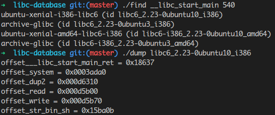

    NX enabled
### 关键点

#### 使用socat将pwn3在端口12345处打开
    socat tcp-listen:12345, fork EXEC:./pwn3

#### 利用[libc-database](https://github.com/niklasb/libc-database)信息泄露获取libc版本，从而得知system地址

#### 可以使用objdump -R pwn3获取PLT表

#### 将printf中的%nc分开2次写可以有效减少n的值

#### 首先利用put将printf字符串格式漏洞的payload写入文件中，文件名为shellcode，然后利用get查看该文件触发get中printf的漏洞修改puts的GOT表为system函数，最后利用dir调用puts函数，执行shellcode

### 参考
[CCTF pwn3格式化字符串漏洞详细writeup](https://www.anquanke.com/post/id/83835)